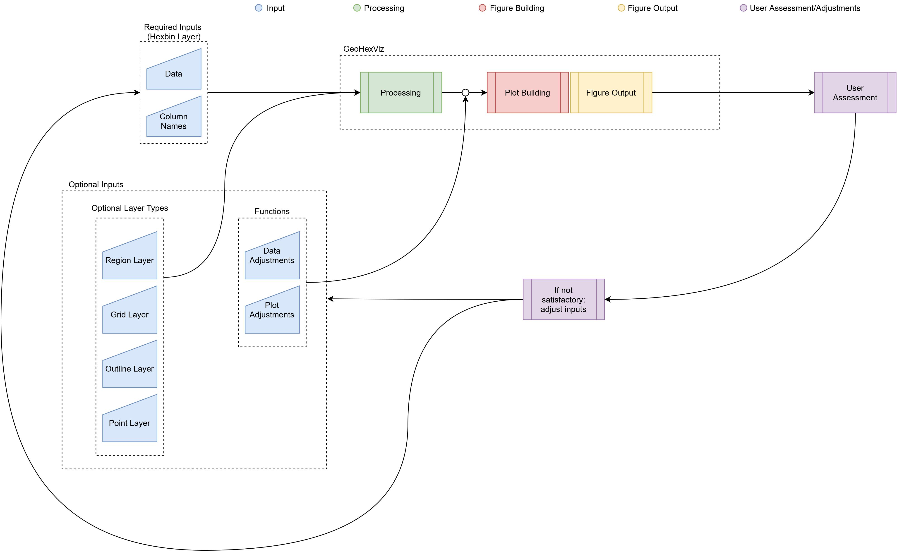
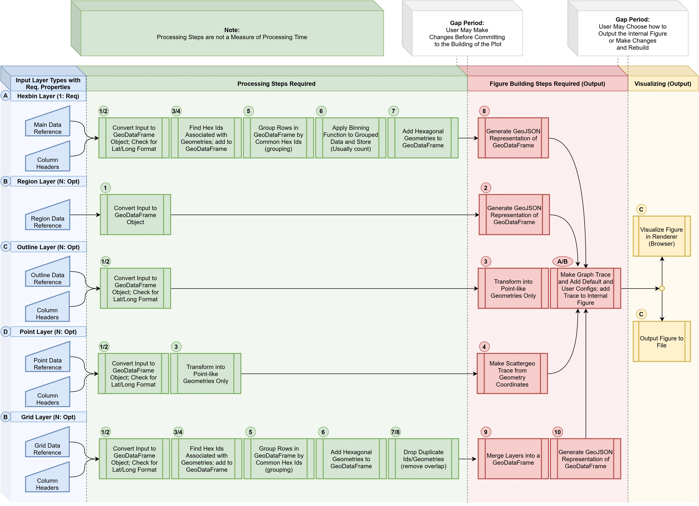

# GeoHexViz's presentation
GeoHexViz is a Python package that provides a high-level method of generating hexagonally binned geospatial visualizations. 
It does this by using simple-to-understand function definitions that add and modify layers within an internal plot object.
A high-level interpretation of GeoHexViz is provided below.
The figure also depicts how a user should interact with GeoHexViz.



In the guts of GeoHexViz, once a layer is input it is processed.
When the final plot is built, these layers are then added to the internal figure.
The relationship between input, processing, and output can be seen below.



## Installation
There are a few steps that a user must follow when installing GeoHexViz.
First, the user must install GeoPandas.
This is most easily done through the use of Anaconda, with this tool it can be installed like this:
```bash
conda install -c conda-forge geopandas
```
The version that GeoHexViz was developed with is version 0.8.1 (build py_0).
Next, the user must download or clone GeoHexViz's GitHub repository.
Finally, the user can run the `setup.py` file like this:
```bash
python setup.py install
```
Setting up a conda environment first helps.
To make this process smoother the `environment.yml` file is included, which includes all dependencies.
Using this file an environment can be set up like this:
```bash
conda env create -f environment.yml
```

## Running Tests
GeoHexViz has been integrated with Travis CI, so every new build is tested.
There are also test files included (created with unittest).
These files can be run in order to test GeoHexViz.